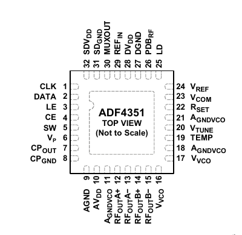
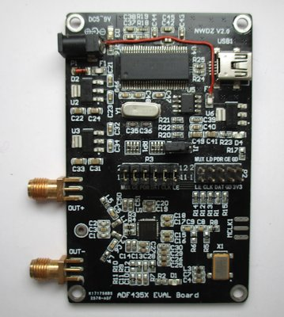

pyadf435x
=========

**pyadf435x** is a suite of software and firmware for controlling the Analog
Devices ADF435x series of wide-band RF PLL synthesizers.

 

The software is developed and maintained on Linux Debian Stable and should work on systems with a `libusb-1.0`
implementation, e.g. FreeBSD, MacOS or even Windows (with the help of [Zadig](https://zadig.akeo.ie/)).

The suite consists of the following components:

* **adf435x** - A python library that can control the ADF4350/1 via various hardware interface back-ends.
* **adf435xctl** - A command line tool to control the ADF4350/1 manually.
* **adf435xinit** - A command line tool to transfer the FX2 firmware to the RAM of the EVAL-ADF4351 board.
* **fx2adf435xfw.ihx** - A firmware file for upload to the RAM of the Cypress FX2
  that replaces the proprietary firmware for the EVAL-ADF4351 board.
* **fx2adf435xfw.iic** - The same firmware in the file format for permanent storage in the EEPROM of the Cypress FX2.
* **stm32adf435xfw.bin**  - A similar (untested) firmware for the STM32F103, see [`README_stm32.md`](README_stm32.md).

It's also possible to use the [Bus Pirate](http://dangerousprototypes.com/docs/Bus_Pirate) as the interface for the `SPI`
communications, simply using the `adf435x.interfaces.BusPirate` class.

Another optional interface is the experimental [DigiSpark Tiny85 module](firmware/tinyADF) with Arduino SW
that receives USB serial commands, simply using the `adf435x.interfaces.tinyADF` class.

adf435x
-------

### Installation

1. Install depedencies:

   On Debian/Ubuntu:
   ```sh
   sudo apt install python3-setuptools python3-usb
   ```

2. Build a Debian package:
   ```sh
   make deb
   ```

3. Install the Debian package:
   ```sh
   make debinstall
   ```

### Usage

See the `examples/` sub-directory.

adf435xctl
----------

Requires **adf435x** to be installed.

```
usage: adf435xctl [-h] [--device-type DEVICE_TYPE] [--freq FREQ] [--ref-freq REF_FREQ]
                  [--r-counter R_COUNTER] [--ref-doubler] [--ref-div2]
                  [--feedback-select FEEDBACK_SELECT]
                  [--band-select-clock-divider BAND_SELECT_CLOCK_DIVIDER]
                  [--band-select-clock-mode BAND_SELECT_CLOCK_MODE] [--int INT] [--frac FRAC]
                  [--mod MOD] [--phase-value PHASE_VALUE] [--prescaler-4-5]
                  [--low-noise-spur-mode LOW_NOISE_SPUR_MODE] [--mux-out MUX_OUT]
                  [--double-buff-r4] [--charge-pump-current CHARGE_PUMP_CURRENT] [--ldp LDP]
                  [--pd-polarity PD_POLARITY] [--powerdown] [--cp-three-state]
                  [--counter-reset] [--abp ABP] [--charge-cancel] [--csr]
                  [--clk-div-mode CLK_DIV_MODE] [--clock-divider-value CLOCK_DIVIDER_VALUE]
                  [--output-divider OUTPUT_DIVIDER] [--vco-powerdown]
                  [--mute-till-lock-detect] [--aux-output-select AUX_OUTPUT_SELECT]
                  [--aux-output-enable] [--aux-output-power AUX_OUTPUT_POWER]
                  [--output-disable] [--output-power OUTPUT_POWER] [--ld-pin-mode LD_PIN_MODE]
                  [--r0 R0] [--r1 R1] [--r2 R2] [--r3 R3] [--r4 R4] [--r5 R5]
                  [--interface INTERFACE] [--lock-detect] [--version] [-v]

Control program for ADF4350/1 eval board

optional arguments:
  -h, --help            show this help message and exit
  --device-type DEVICE_TYPE
                        default = 1
  --freq FREQ, -f FREQ  default = 50.0
  --ref-freq REF_FREQ   default = 25.0
  --r-counter R_COUNTER
                        default = 1
  --ref-doubler         default = False
  --ref-div2            default = False
  --feedback-select FEEDBACK_SELECT
                        default = 1
  --band-select-clock-divider BAND_SELECT_CLOCK_DIVIDER
                        default = None
  --band-select-clock-mode BAND_SELECT_CLOCK_MODE
                        default = 0
  --int INT             default = 100
  --frac FRAC           default = 0
  --mod MOD             default = 2
  --phase-value PHASE_VALUE
                        default = None
  --prescaler-4-5       default = False
  --low-noise-spur-mode LOW_NOISE_SPUR_MODE
                        default = 0
  --mux-out MUX_OUT     default = 0
  --double-buff-r4      default = False
  --charge-pump-current CHARGE_PUMP_CURRENT
                        default = 2.5
  --ldp LDP             default = 10.0
  --pd-polarity PD_POLARITY
                        default = 1
  --powerdown           default = False
  --cp-three-state      default = False
  --counter-reset       default = False
  --abp ABP             default = 10
  --charge-cancel       default = False
  --csr                 default = False
  --clk-div-mode CLK_DIV_MODE
                        default = 0
  --clock-divider-value CLOCK_DIVIDER_VALUE
                        default = 150
  --output-divider OUTPUT_DIVIDER
                        default = 1
  --vco-powerdown       default = False
  --mute-till-lock-detect
                        default = False
  --aux-output-select AUX_OUTPUT_SELECT
                        default = 0
  --aux-output-enable   default = False
  --aux-output-power AUX_OUTPUT_POWER
                        default = -4.0
  --output-disable      default = False
  --output-power OUTPUT_POWER
                        default = 5.0
  --ld-pin-mode LD_PIN_MODE
                        default = 1
  --r0 R0
  --r1 R1
  --r2 R2
  --r3 R3
  --r4 R4
  --r5 R5
  --interface INTERFACE
                        INTERFACE: FX2 (default), BusPirate, tinyADF, NONE
  --lock-detect         query adf435x digital lock detect state
  --version             show adf435x version
  -v                    increase verbosity

adf435x version 0.3.1
```

### Usage Examples

Sets the output frequency to 1000 MHz.
The program `adf435xctl` returns `0` (no error) on success, otherwise `!= 0`.
```sh
./adf435xctl --freq=1000
```

Sets the output frequency to 1000 MHz, sets MUXOUT pin to reflect LD (6 = digital lock detect) and checks the pin status.
When locked, the command prints "LOCKED" and returns `0` (no error), otherwise it prints "NOLOCK" and returns `1` (error).
```sh
./adf435xctl --freq=1000 --lock-detect
```

This allows to chain the program.
```sh
./adf435xctl --freq=1000 --lock-detect && echo SUCCESS
```

fx2adf435xfw
------------

The Cypress FX2 firmware is intended for the Anlog Devices board EVAL-ADF435x or compatible settings,
e.g. a combination of a ADF4351 breakout board with a Cypress FX2 eval board.
It controls the ADF435x synthesizer chip by bit-banging three of FX2's GPIOs.
The firmware provides these vendor commands:

-  `CMD_SET_REG` (0xDD) - write 4 or 5 byte - the optional 5th byte shall contain `32` (register size)
to be compatible with the Analog Devices evaluation software.
The 4 byte register content is written to the ADF435x registers via the SPI connection.
-  `CMD_GET_MUX` (0xE0) - read 1 byte where `bit 0` reflects the state of the `MUXOUT` pin of ADF435x.
The other bits 1..7 are reserved and currently set to `0`.

The firmware requires the following wiring:

|  FX2 Pin  |     |  ADF4350/1 Pin  |
|  -------  | --- |  -------------  |
|  33 (PA0) | --> |  3 (LE)         |
|  34 (PA1) | --> |  1 (CLK)        |
|  35 (PA2) | --> |  2 (DATA)       |
|  25 (PB0) | <-- | 30 (MUXOUT)     |

The PB0 - MUXOUT connection is required only if you want to read the state of the MUXOUT pin,
e.g. to get the LD (lock detect) condition (set MUXOUT bits of reg 2 to 6).

### Building

1. First init/update all the sub-modules within the git repository, silence the message about changed submodule:
   ```sh
   git submodule update --init
   git update-index --assume-unchanged firmware/fx2/fx2lib
   ```

2. Install AutoTools and the SDCC (Small Devices C Compiler).

   On Debian/Ubuntu:
   ```sh
   sudo apt install autoconf automake make sdcc
   ```

3. Build the firmware:
   ```sh
   make firmware
   ```

   You will get the firmware files `fx2adf435xfw.ihx` and `fx2adf435xfw.iic`

### Upload the firmware into RAM

If you didn't already store the firmware permanently in EEPROM (see later),
the upload must be performed each time the module is connected to the PC.
This has the advantage, that you cannot *brick* your device, even when you upload corrupt FW.
Just disconnect and reconnect and upload the correct FW.

#### Preparation

Install *cycfx2prog*.

   On Debian/Ubuntu:
   ```sh
   sudo apt install cycfx2prog
   ```

1. Connect the FX2 board to the USB, a typical FX2 eval board should come up with VID:PID `04b4:8613`,
while an Analog Devices ADF435x eval board clone announces typically as `0456:b40d` or `0456:b403`.
2. Load the firware file `fx2adf435xfw.ihx` to the unconfigured Cypress FX2 RAM with the following command:
   ```sh
cycfx2prog prg:fx2adf435xfw.ihx run
   ```
   or use the command `./adf435xinit`.
   If the eval board clone announces already as e.g. `0456:b40d`, modify the upload command:
   ```sh
cycfx2prog -id=0x0456.0xb40d prg:fx2adf435xfw.ihx run
   ```
3. The device will now renumerate with the VID:PID `0456:b40d` as an *"ANALOG DEVICES"* *"EVAL-ADF4351"*.

### Store the firmware permanently in EEPROM

If you're an experienced FX2 hacker you can also store the firmware file `fx2adf435xfw.iic`
permanently in the *large* 8K or 16K EEPROM of the FX2 board.
For technical details see the Cypress [AN50963](https://www.cypress.com/file/43391/download).
Even with this approach you cannot *brick* your device, if the storage fails, just deactivate the EEPROM
(e.g. with a jumper on the FX2 board) and repeat the programming.

#### fx2eeprom

You can use the simple command line tool [fx2eeprom](https://github.com/Ho-Ro/fx2eeprom).

1. Prepare the tools
```sh
apt install cycfx2prog libusb-1.0-0-dev
git clone https://github.com/Ho-Ro/fx2eeprom.git
cd fx2eeprom
make
```
2. Copy the file `fx2adf435xfw.iic` into the `fx2eeprom` directory.
3. Activate the *large* EEPROM, on my Chinese eval board by removing the jumper `JP1`.
4. Connect the device, check the VID:PID, e.g. with `lsusb` or `sudo dmesg`,
   it's typically `0x0456`:`0xb40d` (ADF435x eval board) or `0x0456`:`0xb403` (ADF4xxx interface).
5. Load the Cypress EEPROM helper firmware into RAM, `cycfx2prog` should be in your path
(**use the correct VID:PID from above**):
```sh
cycfx2prog -id=0x0456.0xb40d prg:vend_ax.hex run
```
6. Write the firmware into EEPROM, **use the same VID:PID as above**.
```sh
./fx2eeprom w 0x0456 0xb40d < fx2adf435xfw.iic
```
7. Disconnect and reconnect the eval board, it will now come up with VID/PID `0456:b40d`
as an *"ANALOG DEVICES"* *"EVAL-ADF4351"* and can be used immediately from now on.

#### cyusb

Another possibility is to use the GUI program [cyusb](https://github.com/Ho-Ro/cyusb_linux)
that has a lot of additional features.

1. Build and install it following the [instructions](https://github.com/Ho-Ro/cyusb_linux#readme).
2. Make sure you do not have another Cypress FX2 based device (e.g. a Salae LA clone) connected to your PC.
3. Deactivate the *large* EEPROM - on my Chinese eval board by setting the jumper `JP1`
   in the [center of the board](images/ADF435X_EVAL_Board.jpg), this changes the EEPROM address line `A0`
   from HI to LO and alters its I2C address from `0xA2` to `0xA0`.
   As the FX2 reads its VID/PID setting on power-on either from a *small* EEPROM at `0xA0` or a *large* EEPROM at `0xA2`
   the I2C read is not possible and the device comes up with the FX2 default setting `04b4:8613`
4. Connect the board to USB where it will enumerate as `04b4:8613`.
5. Remove the address jumper `J1`, this enables the *large* EEPROM access again without changing the USB IDs.
6. Start the program `cyusb`, the board is detected with VID:PID `04b4:8613` (Cypress FX2 chip).
7. Select this device, open the `Program` tab, select `Download to Large EEPROM`.
8. Select the file `fx2adf435xfw.iic` and start the download. After success close the program.
9. Disconnect and reconnect the eval board, it will now come up with VID/PID `0456:b40d`
   as an *"ANALOG DEVICES"* *"EVAL-ADF4351"* and can be used immediately from now on.

