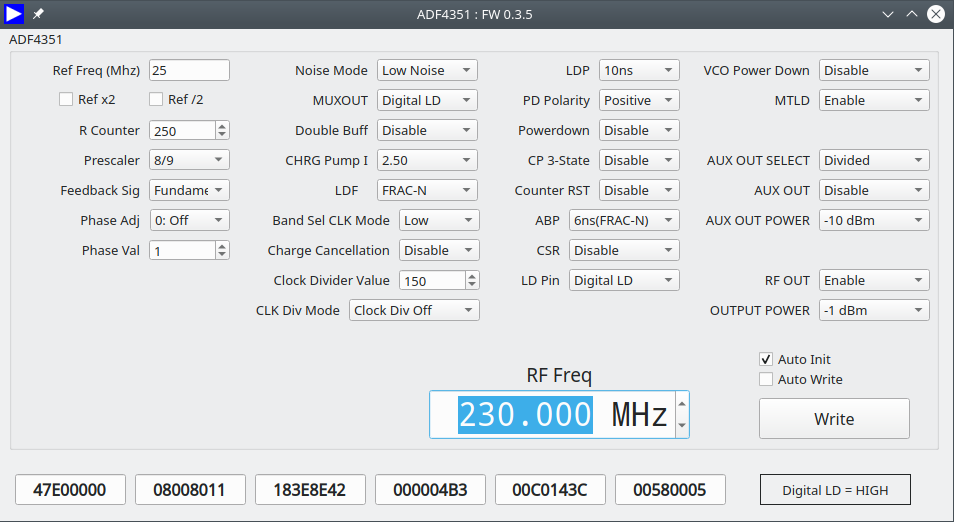

adf435xgui
==========

QT-based user interface for the ADF4351 Eval board.



### Usage

```
Usage: adf435xgui [options]

Options:
  -f, --frequency <frequency>  set initial frequency
  -v, --verbose <verbosity>    Trace program start and processing steps
  -h, --help                   Displays help on commandline options.
  --help-all                   Displays help including Qt specific options.
```

### Development

You need a libusb and QT development installation.
If you use `qtcreator` you can simply open the file `adf435xgui.pro` to edit the project.

### Building

Just type:
```sh
qmake
make
```
This creates the executable `adf435xgui` in the build directory,
either `linux` or `mac` or `windows`, depending on your OS.

